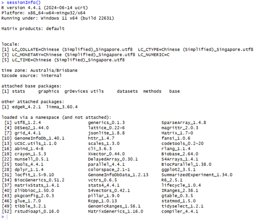

# IFN646 Project

This repository contains the code and data needed for the IFN646 project.

## Task 1

In this task, we will perform differential expression analysis using **DESeq2** and **edgeR**. All necessary data is provided in the `Data` folder:

- `count.txt`: Contains count data for analysis.
- `meta.txt`: Contains metadata corresponding to the count data.

### Instructions

1. Install necessary R packages (`DESeq2`, `edgeR`).
2. Load the data from `count.txt` and `meta.txt`.
3. Follow the script provided in the code for DESeq2 and edgeR analysis.


sessionInfo():   



## Task 2

In this task, we will use **FlashFry**, a tool for genome-wide guide RNA (gRNA) design. FlashFry can be downloaded from the following link:

- [FlashFry GitHub Repository](https://github.com/mckennalab/FlashFry?tab=readme-ov-file)


The commands to run FlashFry are provided in the `command.txt` file in this repository. Please refer to this file to execute the necessary steps for gene data processing.
### Commands  


In this section, we will use **FlashFry** to index, discover, and score guide RNAs (gRNAs) for genome-wide gRNA design. Below are the steps and commands required to complete this process.

#### Step 1: Indexing the Reference Genome

To index the reference genome, create a temporary directory (`tmp`) for storing intermediate files and then run the following command:

```bash
mkdir tmp
java -Xmx4g -jar FlashFry-assembly-1.15.jar index \
    --tmpLocation ./tmp \
    --database Human_database \
    --reference GCF_000001405.26_GRCh38_genomic.fna \
    --enzyme spcas9ngg
```
--tmpLocation: Location for temporary files.  
--database: Name of the output database for indexed genome.  
--reference: Path to the reference genome file (in .fna format).  
--enzyme: The Cas9 enzyme used (spcas9ngg).  


#### Step 2: Discovering gRNAs

```bash
java -Xmx4g -jar FlashFry-assembly-1.15.jar discover \
    --database Human_database \
    --fasta exon.fasta \
    --output exon.output
```
--fasta: Input FASTA file containing the target sequences.  
--output: Output file containing the discovered gRNAs.  

#### Step 3: Scoring gRNAs


```bash
java -Xmx4g -jar FlashFry-assembly-1.15.jar score \
    --input exon.output \
    --output exon.output.scored \
    --scoringMetrics doench2014ontarget,doench2016cfd,dangerous,hsu2013,minot \
    --database Human_database
```
--input: The output file from the discover step.  
--output: The file to store the scored gRNAs.  
--scoringMetrics: A list of scoring metrics used for evaluating gRNA efficacy and safety.  

For additional guidance, please refer to the [official FlashFry documentation](https://github.com/mckennalab/FlashFry).

### Gene Data

The required gene data for this task can be downloaded from the following link:

- [Gene Data on Kaggle](https://kaggle.com/datasets/93ebb4a1b3131a5dc93e77adf6648d2c088ab7fddb16dcada3ceeb4976e07476)

---

## Task 3

The code for Task 3 is contained in the Jupyter notebook file `task3.ipynb`. Please download and use this file to carry out the analysis.

### Instructions

1. Download the `task3.ipynb` file from this repository.
2. Install the required Python libraries as per the notebook’s instructions.
3. Execute the notebook step-by-step to create the modified references.
4. Use the modified reference to run the [task 2](#task-2) again.

### Data

The data for Task 3 can also be downloaded from the same Kaggle dataset used in Task 2:

- [Data on Kaggle](https://kaggle.com/datasets/93ebb4a1b3131a5dc93e77adf6648d2c088ab7fddb16dcada3ceeb4976e07476)

---

For any issues or questions, feel free to open an issue in this repository.
